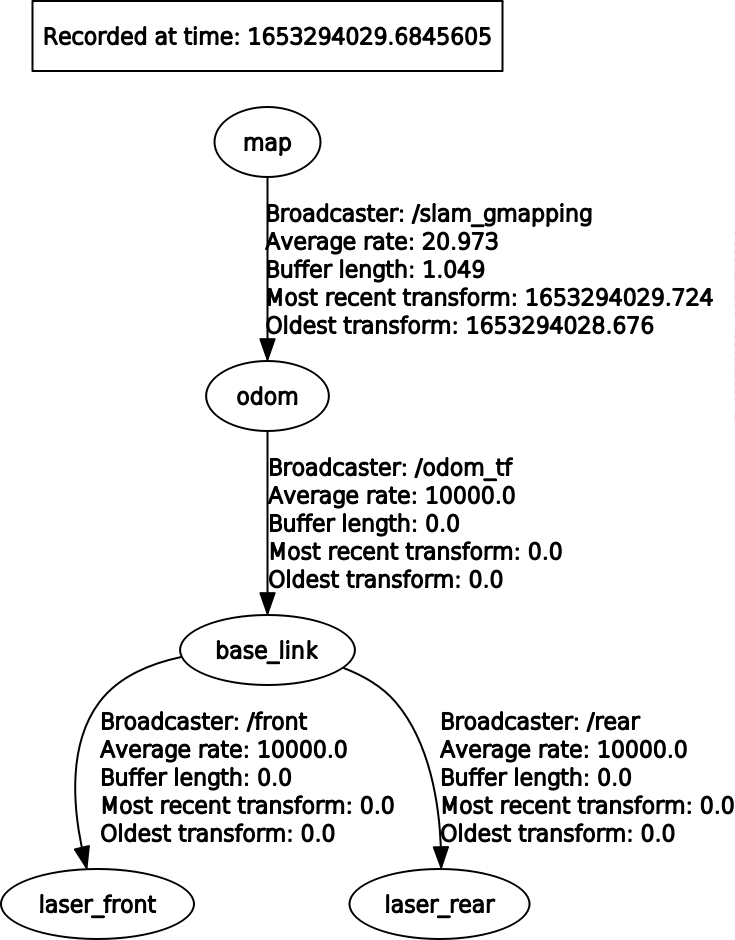

# Team Members
- 10623973 Matteo Fabris
- 10571388 Samuele Portanti
- 10609456 Luca Venturini

# Files Description
The "src" folder contains the p2_core folder with 3 nodes:
- The first node is used to broadcast the TF
- The second node broadcast the path of the robot till that moment, reading the messages sent by amcl regarding the robot position
- The third node, saver, is used to save th emap and the trajectory, we have taken the code from the github page of mapsaver, and then we have applied some customization to it, in order to save the trajectory and the map calling services.


# TF Tree


# Used bags

We have used the first bag to create the map, the others two to do the localization.

Gmapping has been used for map creation.

# How to start

The mapping can be started using the launchfile ```mapping.launch```, with the command:

```roslaunch p2_core mapping.launch ```

The localization can be started using the launchfile ```amcl.launch```, with the command:

```roslaunch p2_core amcl.launch```


# Services

#### The two services can be used to save the map and the trajectory, the images will be saved in the .ros folder

In order to save the map, without the trajectory, it is possibile to call the service:
```
rosservice call /save_map image_name
```

If we want to save the map and the trajectory, we run:
```
rosservice call /save_path image_name
```

# Useful Info
We have decided to create the map using Gmapping, we have tried setting different parameters, chinging the number of particles, the ranges,...
In order to merge the two lasers we have used ira_laser_tools, which provide the functionality of merging the values of multiple scanners.
Finally for the localization we have used the amcl package, setting the parameter ```odom_model_type``` as ```omni-corrected``` and consequently the alphas values, to get a reasonable trajectory.

We have decided to exploit part of the code of map_saver to generate an image of the map and to draw also the trajectory of the robot.
In particular the trajectory is built reading the values from the message containing the path information. Once the service is called a linear interpolation between the points is done, in order to have a smooth trajecotry, since the message containing the path has not all the points but just some "samples" retreived from time to time.

After this we order the points to read the array just once while building the map pixel by pixel, reducing the time complexity, in fact using a non ordered array increases a lot the time required to save the map.
